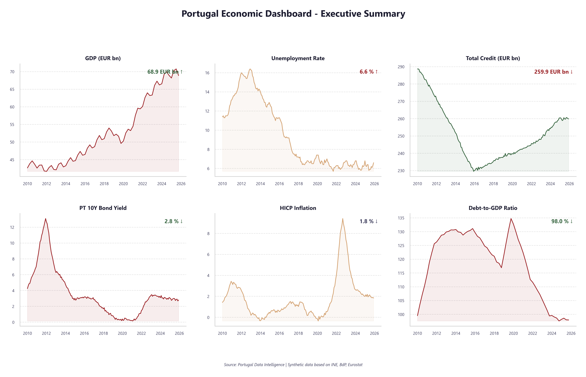
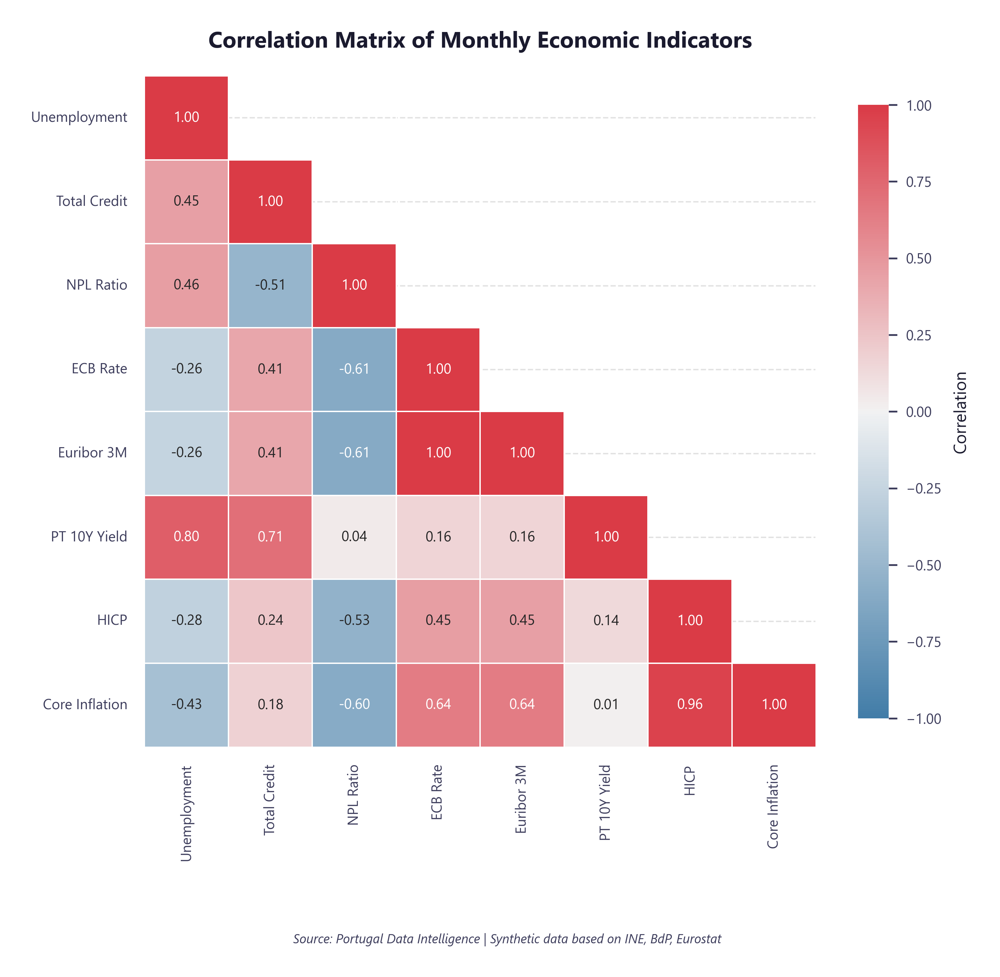
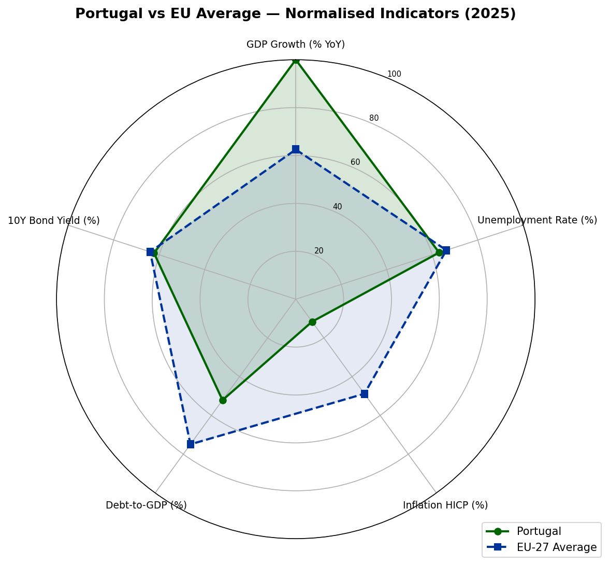

# Portugal Data Intelligence

**A comprehensive macroeconomic analytics platform for the Portuguese economy (2010-2025)**


**[View Live Report →](https://dms1996.github.io/Portugal-Data-Intelligence/)**


---

## Executive Summary

Portugal Data Intelligence is an end-to-end data analytics solution that examines the structural evolution of the Portuguese economy across six fundamental macroeconomic pillars. The platform ingests data from authoritative national and European statistical sources, applies rigorous ETL processes, and delivers AI-augmented insights through interactive dashboards and executive-grade reports.

Designed to demonstrate professional-grade data engineering, analytical rigour, and business intelligence delivery, this project follows methodologies consistent with Big Four consulting engagements in economic advisory and public sector analytics.

### Key Objectives

- **Consolidate** macroeconomic data from multiple Portuguese and European statistical authorities
- **Analyse** structural trends, cyclical patterns, and cross-pillar correlations across a 15-year horizon
- **Benchmark** Portugal against EU-27 averages across key normalised indicators
- **Generate** AI-powered narrative insights using large language models
- **Deliver** boardroom-ready reports in Power BI, PowerPoint, and self-contained HTML formats
- **Monitor** data quality, drift detection, and configurable alert thresholds

---

## Sample Outputs

### Economic Dashboard

A single-view summary of all six macroeconomic pillars — GDP, unemployment, credit, interest rates, inflation, and public debt — spanning 2010 to 2025.



### Cross-Pillar Correlation Analysis

Pearson correlation matrix revealing how Portugal's key economic indicators interact — from the unemployment-bond yield link (0.80) to the inflation-NPL inverse relationship (-0.53).



### Portugal vs EU Benchmark

Radar chart comparing Portugal against the EU-27 average across five normalised indicators (2025). Highlights areas of convergence and divergence with European peers.



> All charts are generated programmatically by the pipeline (`python main.py --mode analysis`) at 300 DPI.

---

## Architecture Overview

```
 DATA SOURCES                ETL PIPELINE               ANALYTICS LAYER            OUTPUT
+------------------+    +--------------------+    +----------------------+    +------------------+
|  INE             |    |                    |    |                      |    |  Power BI        |
|  Banco de        |--->|  Extract (CSV/API) |--->|  Statistical         |--->|  Dashboards      |
|  Portugal        |    |  Transform (Clean) |    |  Analysis            |    |                  |
|  PORDATA         |    |  Load (SQLite)     |    |                      |    |  PowerPoint      |
|  Eurostat        |    |  Data Quality Gate |    |  AI Insight          |    |  Presentation    |
|  ECB             |    |  Lineage Tracking  |    |  Generation          |    |                  |
+------------------+    +--------------------+    |                      |    |  HTML Report     |
                                                  |  STL Decomposition   |    |  (self-contained)|
                                                  |  Forecasting (ARIMA) |    |                  |
                                                  |  Backtesting         |    |                  |
                                                  |  Alert Engine        |    |                  |
                                                  +----------------------+    +------------------+
                                                           |
                                                  +--------v---------+
                                                  |  SQLite Database  |
                                                  |  (Central Store)  |
                                                  +------------------+
```

---

## Data Pillars

| # | Pillar | Granularity | Period | Primary Source |
|---|--------|------------|--------|----------------|
| 1 | Gross Domestic Product (GDP) | Quarterly | 2010 Q1 - 2025 Q4 | INE / Eurostat |
| 2 | Unemployment | Monthly | Jan 2010 - Dec 2025 | INE / Eurostat |
| 3 | Credit to the Economy | Monthly | Jan 2010 - Dec 2025 | Banco de Portugal |
| 4 | Interest Rates | Monthly | Jan 2010 - Dec 2025 | Banco de Portugal / ECB |
| 5 | Inflation (HICP / CPI) | Monthly | Jan 2010 - Dec 2025 | INE / Eurostat |
| 6 | Public Debt | Quarterly | 2010 Q1 - 2025 Q4 | Banco de Portugal / PORDATA |

---

## Data Sources

| Source | Description | URL | Format |
|--------|------------|-----|--------|
| **INE** (Instituto Nacional de Estatistica) | Portugal's national statistics office | [ine.pt](https://www.ine.pt) | CSV / JSON API |
| **Banco de Portugal** | Central bank statistical databases | [bportugal.pt/EstatisticasWeb](https://bpstat.bportugal.pt) | CSV / Excel |
| **PORDATA** | Contemporary Portugal database | [pordata.pt](https://www.pordata.pt) | Excel / CSV |
| **Eurostat** | European statistical office | [ec.europa.eu/eurostat](https://ec.europa.eu/eurostat) | CSV / JSON API |

---

## Tech Stack

| Layer | Technology | Purpose |
|-------|-----------|---------|
| **Language** | Python 3.10+ | Core programming language |
| **Database** | SQLite 3 | Lightweight relational data store |
| **Query Language** | SQL | Schema design, analytical queries, and data aggregation |
| **BI Language** | DAX | 39 Power BI measures across 7 categories |
| **Data Processing** | pandas, NumPy | Data manipulation and numerical computing |
| **Visualisation** | matplotlib, seaborn, Plotly | Statistical and interactive charts |
| **Time Series** | statsmodels | STL decomposition, SARIMAX forecasting |
| **Machine Learning** | scikit-learn, SciPy | Statistical modelling and significance tests |
| **AI Insights** | OpenAI GPT API | Narrative generation and anomaly commentary |
| **Reporting** | python-pptx | Automated PowerPoint presentations |
| **HTML Reports** | Jinja2 / custom | Self-contained Big4-style HTML briefings |
| **BI Dashboard** | Power BI | Interactive executive dashboards |
| **Documentation** | MkDocs | Project documentation site |
| **Containerisation** | Docker | Reproducible pipeline execution |
| **Notebooks** | Jupyter | Exploratory analysis and documentation |

---

## Project Structure

```
portugal-data-intelligence/
├── config/                     # Configuration files, thresholds, and data sources
├── dashboard/
│   └── generate_report.py      # Self-contained HTML report generator
├── data/
│   ├── raw/                    # Raw CSV/Excel files from data sources
│   ├── processed/              # Cleaned, validated, and transformed data
│   └── database/               # SQLite database file
├── docs/                       # MkDocs project documentation
├── notebooks/                  # Jupyter notebooks for exploration
├── reports/
│   ├── data_quality/           # Data quality check reports (JSON)
│   ├── insights/               # AI-generated executive briefings (JSON)
│   ├── powerbi/
│   │   ├── charts/             # Generated chart images (300 DPI)
│   │   └── dax/                # DAX measures organised by category
│   └── powerpoint/             # PowerPoint presentation output
├── sql/
│   ├── ddl/                    # CREATE TABLE, seed scripts
│   └── queries/                # Analytical SQL queries (7 pillars)
├── src/
│   ├── alerts/                 # Configurable threshold alert engine
│   ├── ai_insights/            # AI-powered insight generation (modular)
│   │   ├── ai_narrator.py      # GPT-4 integration
│   │   ├── insight_engine.py   # Core engine and executive briefings
│   │   ├── pillar_insights.py  # Per-pillar rule-based narratives
│   │   └── cross_pillar_insights.py  # Cross-pillar analysis
│   ├── analysis/               # Statistical analysis and visualisations
│   │   ├── backtesting.py      # Expanding-window forecast validation
│   │   ├── decomposition.py    # STL seasonal-trend decomposition
│   │   ├── forecasting.py      # SARIMAX forecasting with AIC selection
│   │   └── ...                 # Correlation, benchmarking, scenarios
│   ├── etl/                    # Extract, Transform, Load pipeline
│   │   ├── data_quality.py     # 15+ validation checks with JSON reports
│   │   ├── lineage.py          # Batch tracking and data provenance
│   │   └── ...                 # Extract, transform, load, fetch
│   ├── reporting/              # Report generation
│   │   ├── slides/             # Modular PowerPoint slide builders
│   │   └── shared_styles.py    # Shared formatting utilities
│   └── utils/                  # Logger with JSON and correlation ID support
├── tests/                      # 379 tests across 25+ test files
├── Dockerfile                  # Container image for pipeline execution
├── docker-compose.yml          # Docker Compose orchestration
├── Makefile                    # Task automation (make run, make test, etc.)
├── mkdocs.yml                  # Documentation site configuration
├── main.py                     # Single entry point for the full pipeline
├── pyproject.toml              # Project metadata and tool configuration
└── requirements.txt            # Python dependencies
```

---

## Quick Start

```bash
# One command to run everything
python main.py

# Or run specific stages
python main.py --mode etl        # Data fetch from APIs + ETL pipeline
python main.py --mode analysis   # Statistical analysis + chart generation
python main.py --mode reports    # AI insights + PowerPoint presentation
python main.py --mode quick      # ETL + Analysis (skip reports)
python main.py --list            # Show all available modes

# Generate self-contained HTML report
python dashboard/generate_report.py
```

### Using Make

```bash
make run             # Full pipeline
make etl             # ETL only
make analysis        # Analysis + charts only
make reports         # Reports + insights only
make test            # Run test suite with coverage
make lint            # Code quality checks (black, isort, flake8)
make format          # Auto-format code
make docs            # Build MkDocs documentation site
make report-html     # Generate HTML report
make clean           # Remove generated files and caches
```

### Using Docker

```bash
docker-compose up    # Run full pipeline in container
```

---

## Installation

### Prerequisites

- Python 3.10 or higher
- pip (Python package manager)
- Power BI Desktop (optional, for dashboard viewing)

### Setup

```bash
# Clone the repository
git clone https://github.com/dms1996/portugal-data-intelligence.git
cd portugal-data-intelligence

# Create a virtual environment
python -m venv venv
source venv/bin/activate        # Linux / macOS
venv\Scripts\activate           # Windows

# Install dependencies
pip install -r requirements.txt

# (Optional) Install dev dependencies (testing, linting, type checking)
pip install -r requirements-dev.txt

# (Optional) Configure AI insights
cp .env.example .env
# Edit .env and add your OpenAI API key — rule-based insights work without it
```

### Running the Pipeline

```bash
# Run the full pipeline with a single command
python main.py

# Run tests
pytest
```

---

## Key Features

### EU Benchmarking
Compares Portugal against EU-27 averages across GDP growth, unemployment, inflation, debt-to-GDP, and interest rates — with radar charts and small multiples for visual comparison.

### Cross-Pillar Correlation Analysis
Pearson correlation matrix across all six pillars, revealing structural relationships like the unemployment-bond yield link and the inflation-NPL inverse dynamic.

### AI-Powered Insights
Rule-based insight engine with optional OpenAI GPT-4 integration for automated executive briefings, anomaly detection, and narrative commentary. Modular architecture with separate pillar, cross-pillar, and AI narrator components.

### Self-Contained HTML Report
Big4 consulting-style HTML briefing with all charts embedded as base64 data URIs — fully portable, single-file output requiring no external dependencies.

### STL Decomposition
Seasonal-trend decomposition (STL) for unemployment, inflation, and GDP series with 3-panel diagnostic charts isolating trend, seasonal, and residual components.

### Forecasting & Backtesting
SARIMAX forecasting with automatic order selection via AIC and Ljung-Box residual diagnostics. Expanding-window backtesting with MAE, RMSE, MAPE, and directional accuracy metrics.

### Data Quality & Lineage
15+ automated validation checks (schema, ranges, completeness, consistency, freshness) with JSON reports. Full batch tracking with UUID-based `run_id`, SHA-256 file checksums, and provenance metadata.

### Alert Engine
Configurable threshold monitoring with warning/critical severity levels across all six economic pillars. JSON output for integration with external notification systems.

### Drift Detection
Statistical monitoring of data distribution shifts to flag anomalous changes in incoming data.

### 39 DAX Measures
Complete Power BI analytical layer with KPI measures, year-on-year growth calculations, moving averages, derived cross-pillar metrics, period comparisons, and conditional formatting.

### Scenario Analysis
Data-driven scenario analysis (baseline, optimistic, pessimistic) with calibrated coefficients (Okun's law, credit-rate elasticity) for key economic indicators.

---

## Phase Roadmap

| Phase | Description | Status |
|-------|------------|--------|
| **Phase 1** | Project structure, architecture, and dataset specifications | Complete |
| **Phase 2** | Database schema design and DDL scripts | Complete |
| **Phase 3** | Real data ingestion from INE, Banco de Portugal, Eurostat APIs | Complete |
| **Phase 4** | ETL pipeline development | Complete |
| **Phase 5** | Statistical analysis and cross-pillar correlation | Complete |
| **Phase 6** | AI-powered insight generation | Complete |
| **Phase 7** | Power BI dashboard design (DAX measures + specification) | Complete |
| **Phase 8** | Automated PowerPoint report generation | Complete |
| **Phase 9** | EU-27 benchmarking and comparative analysis | Complete |
| **Phase 10** | Testing, validation, and documentation | Complete |
| **Phase 11** | Data lineage, quality framework, STL decomposition, SARIMAX forecasting, backtesting, alert engine, Docker | Complete |
| **Phase 12** | Self-contained HTML report generator (Big4 consulting style) | Complete |

---

## Licence

This project is licenced under the MIT Licence. See `LICENCE` for details.

## Author

Built as a professional portfolio project demonstrating end-to-end data analytics capabilities — from raw data ingestion to executive-ready deliverables.

---

<p align="center">
  <em>dms1996</em>
</p>
